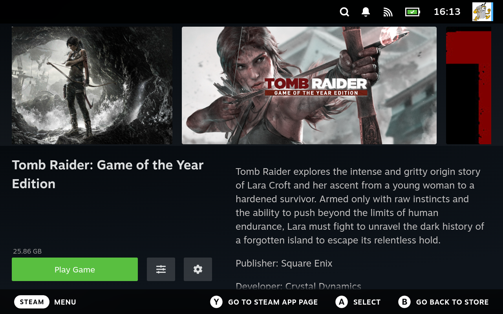
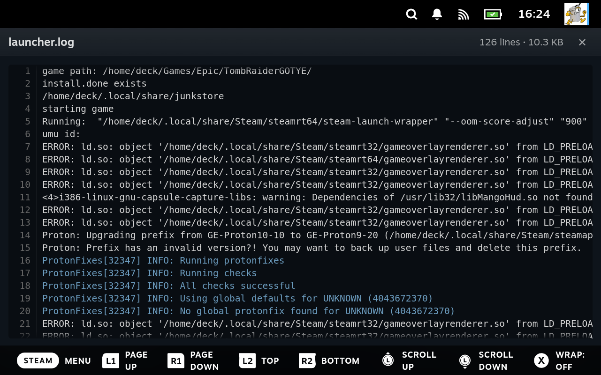
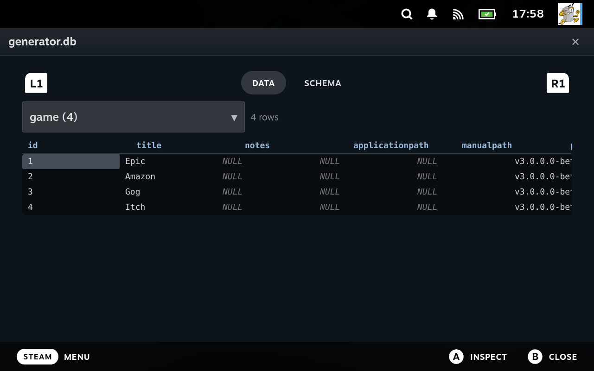
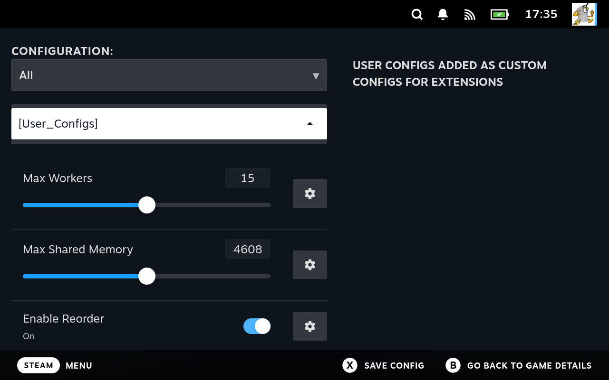

# Workflows: the tools working together

Most of this guide documents one thing at a time. That is what a reference is for, but it
hides the part that matters most in practice: the tools are meant to be used together, and
each one hands off to the next.

This section walks four real jobs end to end. Nothing here is new; every step links to its
full treatment. The point is the shape of the work rather than the detail.

If you read nothing else, read the first one. It is the job people actually spend their time
on.

## A game will not start

This is the common case with games that are not on Steam, and the reason several of these
tools exist at all. Ninety percent of the work is finding out *why*, and none of it requires
leaving game mode.

**Hold SELECT** and Junk Store shows you the four tools it can open from anywhere in the Steam
interface:


The flow uses three of them.

**Start at the game.** Its detail page is where the actions live, and the sliders menu holds
the file manager already pointed at this game.




**1. Read the log.** SELECT + X opens the file manager, or reach it from the menu above and it
arrives already mapped: the game's install directory, its Proton prefix and its shader cache
are in the sidebar, so you are not hunting for paths.


Open `launcher.log` and read the last lines. It usually names the thing that failed.



→ [Step 1: read launcher.log](guides/when-a-game-will-not-run.md#step-1-read-launcherlog)

**2. Look at what it named.** The same file manager opens text, images, PDFs, archives, SQLite
databases and raw binaries. If the log blamed a missing file, look in the folder. If it blamed
a config, open it. If a client keeps its state in a database, that opens too, read only.



→ [Step 3: look at the thing that failed](guides/when-a-game-will-not-run.md#step-3-look-at-the-thing-that-failed)

**3. Check whether it is running.** SELECT + Y opens diagnostics; its Processes tab is a live,
filterable process list.


Filter by the game and watch while you launch. Nothing at all means the launch never happened.
Appears and vanishes means it started and died. Still there with no picture means a display
problem, not a launch problem.
→ [Check whether it is actually running](guides/when-a-game-will-not-run.md#check-whether-it-is-actually-running)

**4. Change one thing and relaunch.** Usually a setting rather than code: a different Proton
version, a launch argument, an environment variable.
→ [Step 4: change one thing, then relaunch](guides/when-a-game-will-not-run.md#step-4-change-one-thing-then-relaunch)

The handoff is the point. The log names a file, the file manager opens it, the process list
says whether the fix worked, and the config screen is where you make the change. No terminal,
no desktop mode, no guessing.

## Getting a folder of ROMs into the interface

The shortest path from a pile of files to a working store tab.

1. **Run the wizard.** It asks for a name, an emulator, and where the ROMs are. Each step shows
   you where the answer will land, with arrows pointing at the tab strip and the menu section.

   

   → [Create a new extension with the wizard](guides/quickstart.md#a-create-a-new-extension-with-the-wizard)

2. **Let it generate.** You now have a real extension: `store.sh`, `settings.sh`, launcher
   scriptlets, and supporting scripts, all registered.

3. **Check the discovery settings if nothing appears.** Usually the ROM extension or the path.
   → [How ROM discovery works](guides/emulators-and-roms.md#how-rom-discovery-works)

4. **Adjust rather than rewrite.** Artwork source, launcher, per game overrides: all settings.
   → [Adjust an extension's settings](guides/quickstart.md#c-adjust-an-extensions-settings)

No code is written at any point. If you later need something the settings cannot express, the
generated scripts are yours to edit, and the next section is how.

## Making one action behave differently

You like an extension but one thing about it is wrong. You do not have to fork it.

1. **Find the action's name** in the store's `ACTIONS` list. Every action is one entry, and
   the Generator shows them as records rather than code.

   

   → [Naming the function you want to replace](guides/overriding-actions.md#naming-the-function-you-want-to-replace)

2. **Write a small override file.** Define a function with the same name; yours wins.
   → [Where to put your file](guides/overriding-actions.md#where-to-put-your-file)

3. **Wrap rather than replace, where you can.** Call the original and adjust its result.
   → [Example: wrap an existing action](guides/overriding-actions.md#example-wrap-an-existing-action)

4. **Check it took effect.** Diagnostics reports each extension's own health checks, and the
   troubleshooting section covers the case where an override is ignored.
   → [My override is not being picked up](troubleshooting.md#my-override-is-not-being-picked-up)

This is the middle rung. Above it is changing a setting; below it is writing the extension
yourself. You are never forced up a level you do not need.

## Teaching Junk Store about a source it has never seen

The general case: a storefront with its own client, an API, an archive on a NAS, a machine on
your network. Whatever it is, two scripts are enough.

1. **`getlisting` says what exists.** One game identifier per line.
   → [Listing and metadata](reference/custom-scripts.md#listing-and-metadata)

2. **`downloader` fetches one.** Put the game at the path you were handed, and print progress
   keys as you go.
   → [Downloader protocol](reference/downloader-protocol.md)

3. **Print progress and get a real progress bar.** You emit keys; Junk Store assembles the
   caption. The bar, the percentage, the speed and the ETA all come from lines your script
   printed.

   

   → [Where your keys end up on screen](reference/downloader-protocol.md#where-your-keys-end-up-on-screen)

4. **Ask the user a question, if you need to.** A script that prints
   `key:::label:::value` lines gets form controls back, with the type inferred from the value:
   brackets make a dropdown, parentheses make a slider, `true` or `false` makes a toggle.

   

   → [The pre install form](reference/custom-scripts.md#the-pre-install-form-getdeps-getdlc-getlanguages-userconfigs)

5. **Report your own health.** A `diagnostics` script's results appear in the diagnostics view
   alongside the built in checks, so a missing client or an expired login shows up as a red
   entry rather than a mysterious failure.

   

   → [Diagnostics](reference/custom-scripts.md#diagnostics)

Satisfy those contracts and your extension is indistinguishable from a shipped one: same grid,
same progress bar, same buttons. Junk Store never asks how the bytes arrived.

## What you do not have to build

The four flows above describe what you provide. The more useful number is what you do not, and
it is easy to miss because absent work leaves no trace in a guide.

For a store extension you write a script that lists games and a script that fetches one. Here
is what arrives already done:

| You do not write | You get |
|---|---|
| Any user interface | The grid, detail pages, artwork, and the store's own tab |
| Progress reporting | Print `Percent:42` and a real progress bar moves |
| Steam integration | Shortcut creation, appid assignment, and compatdata wiring |
| The launch path | `launcher.sh`, per platform scriptlets, and Proton prefix handling |
| Configuration screens | One schema entry becomes a slider, dropdown, or file picker |
| Config storage and resolution | Layering across store, platform, fork, version, and game |
| Argument passing | Resolved settings arrive as environment variables |
| Install lifecycle | Queue, cancel, resume, verify, and repair |
| Controller navigation | Focus handling, which on a handheld is not a small job |
| Diagnostic tooling | File manager, viewers, process list, and health checks |

None of that is optional in a launcher. It is work somebody has to do; the point is that it is
already done, once, for every extension rather than in each one.

### Some of it is not a matter of writing code at all

The table above understates the case, because lines of code are the cheap part. Several of
those rows sit on interfaces Valve does not document for third parties, and the harder problem
is not learning them but living alongside them.

Adding a non Steam game is the clearest example. A shortcut has to be created in a shape Steam
accepts, given an identifier Steam will keep, and matched to a `compatdata` directory before
Proton will run anything. None of that is published. More to the point, **Steam is running the
whole time and owns all of it.** It maintains its own view of your shortcuts, assigns its own
identifiers, and has no idea Junk Store exists. Everything Junk Store does has to fit into that
without the two fighting over the same records.

That is the part that took the longest, and it is not the kind of work that shows up as
volume. It is the difference between something that functions in isolation and something that
coexists with a client that was never told to expect it.

**An extension author never touches any of it.** You print a game identifier and Junk Store
does the rest: the shortcut, the identifier, the prefix, the launch path, and keeping all of
it consistent with what Steam believes.

It is also the layer most exposed when Steam changes, which is another way of saying it is
worth having somewhere other than in your extension.

### What the shipped extensions actually contain

The shipped extensions are on your device, so these numbers are checkable and worth knowing
before you estimate your own. Every hand written script in all four, in lines:

| Script | Itch | Amazon | Epic | GOG |
|---|---|---|---|---|
| `getlisting` | 2 | 38 | 62 | 32 |
| `downloader` | 52 | 169 | 298 | 336 |
| `stop-downloader` | 2 | 7 | 6 | 6 |
| `gamesize` | 1 | 36 | 42 | 62 |
| `getgameinfo` | 77 | 100 | 92 | — |
| `get-launch-options` | 106 | 51 | 55 | 165 |
| `geninstalldeps` | 94 | 65 | 63 | 220 |
| `install_deps.sh` | — | 39 | 48 | 60 |
| `getdeps` | 44 | 44 | 42 | 18 |
| `getdlc` | — | 12 | 39 | 67 |
| `getlanguages` | — | 13 | 36 | 73 |
| `userconfigs` | — | 16 | 20 | 16 |
| `login.sh` | 28 | 26 | 28 | 71 |
| `loginstatus` | 2 | 5 | 27 | 50 |
| `logout` | 4 | 8 | 7 | 9 |
| `listusers` | 3 | 3 | 3 | 3 |
| `switchuser` | 3 | 3 | 3 | 3 |
| `deactivate` | 2 | 3 | 3 | 3 |
| `import` | — | 5 | 4 | 4 |
| `supports-import` | 2 | 2 | 3 | 4 |
| `launcher.sh` | 41 | 41 | 51 | 61 |
| `settings.sh` | 17 | 17 | 17 | 17 |
| **Total, without `diagnostics`** | **480** | **780** | **1006** | **1404** |
| `diagnostics` | 330 | 426 | 453 | 659 |

Those totals are the whole extension: listing, downloading with progress, dependency
generation, launch options, login, logout, account switching and import support. **Itch is a
complete storefront in under 500 lines of shell.**

**Three of these four are carrying two implementations at once.** Amazon, Epic and GOG each
support two clients: the third party flatpak they originally wrapped, and a purpose built
replacement. Which one runs is chosen at run time by a setting, so their `getlisting` and
`downloader` contain both paths:

```python
use_legacy = os.getenv('USE_LEGACY_CLIENTS', 'true').lower() == 'true'
if use_legacy:
    listing = generate_listing_legacy(offline)
else:
    listing = generate_listing(offline)
```

The `'true'` there is only what the script assumes if the variable is missing entirely. The
setting's own default is off, so a normal install runs the native client and the legacy path
is the one you opt into. See [Advanced](reference/settings.md#advanced).

That is an extension author's own decision, not something the format asks for. So the three
larger totals include work a new extension would simply not do: Itch already runs a purpose
built client with nothing to fall back to, which is why it is the smallest number in the table
and the honest baseline for what one implementation costs.

**This is what a migration looks like here.** Replacing the client an extension depends on
does not mean a rewrite or a flag day. The new path is added beside the old one, a setting
decides which runs, and both ship until the new one has earned the default. Users who hit a
problem have somewhere to go back to, and the extension is never in a half converted state.

The mechanism is available to you for the same purpose. Because the setting arrives as an
environment variable, a script can branch on it and swap its entire implementation at run
time, and nothing above the script needs to know. Nothing in the interface is aware that two
implementations exist.

`diagnostics` is kept out of the total because it is optional, and including it would nearly
double the smallest extension while measuring something no extension is required to have.
`store.sh` is left out because nobody writes it: it is generated, and runs 410 to 497 lines
across the four. So is `junklib.py`, which is shared infrastructure rather than per store code.

**Client programs are left out too, and all four rely on one.** None of these extensions talks
to a storefront directly; each drives a separate program that does, and the scripts are glue
around it.

Which program depends on the extension and the setting. Epic, Amazon and GOG each began by
wrapping a third party flatpak, `legendary`, `nile`, and `gogdl` with `lgogdownloader`, and
each now also ships a purpose built replacement, which is why those three carry two code paths.
Itch runs a purpose built client only.

That is worth understanding before you read the totals as a measure of difficulty. A few
hundred lines is what it costs to wrap a client that already knows how to talk to a store; it
is not what it costs to write that client, and it is certainly not what it costs to work out
a storefront's protocol from nothing. If your source has no such client, expect to write more,
and expect most of the extra to be about your source rather than about Junk Store.

The upside is that this is the normal shape rather than a compromise. A `downloader` that
shells out to a tool and translates its output is exactly what the contract is designed for,
which is why the junklib parsers exist. It also means the client is replaceable: three of
these four have replaced theirs without the interface noticing.

Two patterns are worth noticing. **The lifecycle scripts are tiny** — account switching,
logout and import handling are two to nine lines each, in every extension, because they only
have to say what to run.

And **`diagnostics` is the single largest file in all four**, larger in every case than the
downloader. Nothing requires that; it is what these extensions chose to spend code on once the
mechanics stopped needing any. Yours can omit it entirely and still work.

Itch's entire `getlisting` is a shebang and one command:

```bash
#!/usr/bin/env bash

./itch list
```

That is a complete, working storefront integration in the interface: grid, artwork, install,
progress, launch, uninstall. The rest of Itch's downloader is the specific business of talking
to Itch, which is the only part that could not have been written for you.

The larger downloaders are larger for the same reason. Around a quarter of Epic's 298 lines are
a table of regular expressions matching its client's output, and the rest is the business of
driving that client; GOG's are the mechanics of its own download format. Neither spends a line
on the interface, because there is no interface code to write.

**The work you do is the work only you can do.** Everything that is the same for every store
has been factored out, which is why an extension is small enough to read in one sitting.

## What these have in common

Reading the four together shows the design more clearly than any one of them does.

**Every layer has a way out.** Settings, then override an action, then write the scripts
yourself. Most jobs stop at the first.

**The contracts are narrower than the conventions.** rsync, the shipped scriptlets, the
built in download methods: each is a worked answer to a common problem, not a fence. A
downloader that satisfies the output contract gets identical treatment to a shipped one.

**The tools hand off to each other.** The log names a file the browser can open; a script's
output becomes a form control; a setting becomes an environment variable a launcher reads.
That is why capabilities keep appearing that nobody specifically built.
→ [Some of what it does is emergent](concepts/the-generator.md#some-of-what-it-does-is-emergent)

**Diagnosis is a first class activity.** The file manager, viewers, process list and health
checks exist because getting a non Steam game running is mostly investigation, and doing that
from a handheld with no keyboard needs real tools.
