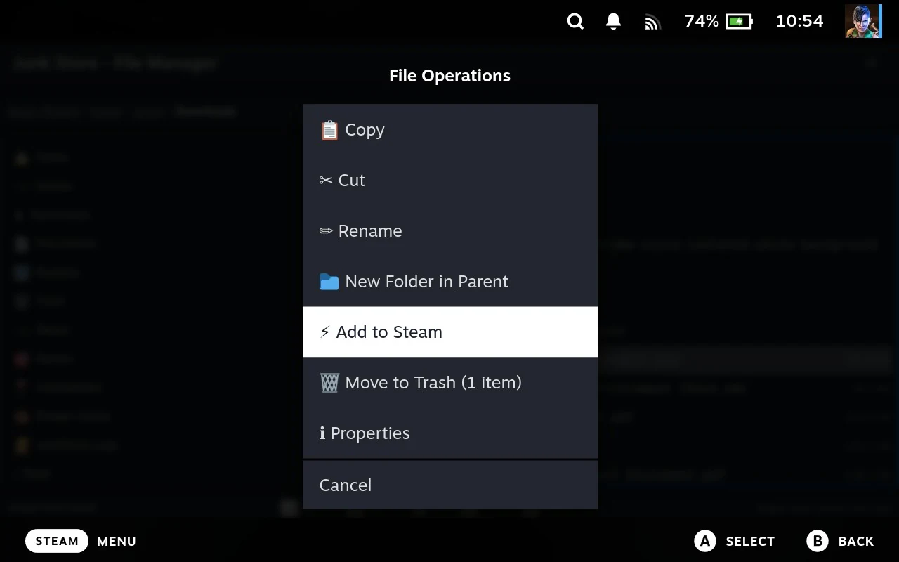

# Setting a game up by hand

Junk Store Pro's tools work on **Steam entries**, not on games from a particular store. Once a
game has an entry in your Steam library, everything else applies to it: artwork, the
executable it launches, what it runs under, how it's tuned.

**That includes entries you make yourself.** Nothing has to know about your game in advance
no extension, no store, no compatibility list. If the files are on the Deck, you can make
an entry and then treat it like anything else.

This page is the route for a game that no store covers: something you installed by hand, an
old game from a folder, an emulator, or a tool you want in your library.

## Why this is worth knowing

**Steam can already do most of these things**, and on a desktop you'd use its own settings.
On a Deck in Game Mode you largely can't: the options exist in a shortcut's properties, but
the file picker behind them misbehaves under gamescope. In practice, setting up a non-Steam
game properly has meant dropping to Desktop Mode and finding a keyboard.

**Here you don't.** Every step below is done from the controller, in Game Mode, and it's the
same set of tools the shipped stores use.

## The steps

Not all of them apply to every game. Do the first, then as many of the rest as it needs.

### 1. Make the entry

Browse to the game's program in [the File Manager](file-manager.md) and use
[Add to Steam](file-manager-steam.md#add-to-steam).

**For an `.exe`, that's most of the work.** Junk Store Pro sets the launcher to Proton and
records the program, its folder and the install path, so it's ready to run. Anything else is
added as a plain entry, and you set what runs it yourself at step 3.

The game appears in your Steam library straight away.

### 2. Point it at the right program

Installers often leave several programs in a folder, and the obvious one isn't always the
game.

**From the File Manager**, [the Steam submenu](file-manager-steam.md#the-steam-submenu) sets
**Set as Game Executable** on a file and **Set as Working Directory** on a folder. Browse the
whole folder and pick exactly what you want.

**From the game's page**, [Run Exe](game-page.md#run-exe) offers a shortlist of the programs it
found, which is quicker when the one you want is on it. Remember the
[toggle-then-X order](game-page.md#changing-what-the-game-launches) if the program needs to run
from its own folder.

**Some games need the working folder set** or they won't find their own data. If a game
starts and immediately complains about missing files, that's the usual cause.

### 3. Choose what runs it

On the game's cog, [the platform's configs](game-settings.md#the-platforms-configs) sets what
Junk Store Pro launches the game through, Proton for a Windows game, or another platform where
that fits.

Add to Steam already does this for an `.exe`, so it's mainly the step for anything else: a
DOS game, something for an emulator, or a Linux program.

**If a Windows game needs a particular Proton version**, that's Steam's setting rather than
this one. Press **Y** on the game's page to reach its Steam page and change the compatibility
tool there; the Junk Store website covers it.

### 4. Give it artwork

A hand-made entry starts with nothing, so it sits in your library as a plain box.

**If you have pictures of your own**, assign them with
[the Steam submenu](file-manager-steam.md#the-steam-submenu): browse to each image and give
it a slot.

**If you don't**, [Search SteamGridDB](game-page.md#search-steamgriddb) finds artwork by name and
applies it for you, which is usually the faster route. It needs
[a key](settings.md#steamgriddb) set up once.

### 5. Tune it, if it needs tuning

[Proton settings](game-settings.md#proton-settings) on the game's cog has the things people
reach for when a Windows game misbehaves or runs badly: anti-cheat runtimes, ESYNC and
FSYNC, a frame cap for battery life, FSR upscaling, and frame generation.

**Skip this unless something's wrong.** The defaults are what most games want.

### 6. Install anything it's missing

Old Windows games sometimes want a runtime that isn't present. Copy the installer into the
game's folder and run it with
[Run Exe](game-page.md#installing-a-dependency-that-isnt-in-the-dependencies-list), it runs
inside that game's own environment, so what it installs is there for the game and nowhere
else.

## What you end up with

An entry that behaves like any other: it launches from Steam, it has artwork, it runs under
a compatibility layer you chose, and its settings are per game.

**Some things won't apply.** A hand-made entry has no store behind it, so there's nothing to
refresh it from, no DLC or language list, and no verify or repair. Those come from an
extension knowing how to talk to a store.

**It's manual, and that's the trade.** A game from a store arrives configured; this is you
doing that work yourself, a step at a time. What you get for it is that the answer to "can
Junk Store Pro handle this game?" is usually yes, by this route, whatever the game is.

## Related

- Making the entry: [The File Manager and Steam](file-manager-steam.md#add-to-steam)
- Setting the executable from a list: [Run Exe](game-page.md#run-exe)
- What runs the game, and tuning it: [A game's own settings](game-settings.md)
- Getting the files onto the Deck in the first place:
  [The File Manager](file-manager.md) and [Reaching another machine](networking.md)
